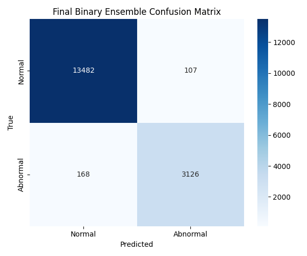

## ECG Anomaly Detection – Technical Report

### 1. Problem Statement and Overview
Binary ECG beat classification framed as anomaly detection: predict whether a beat is Normal (0) or Abnormal (1). Normal symbols: {N, L, R, e, j}; all others mapped to Abnormal. The solution combines classic machine learning stacking on engineered features with a hybrid deep network that learns morphology from raw ECG segments.

### 2. Dataset and Features
- Source: MIT-BIH Arrhythmia Database (mitdb) via WFDB in notebooks.
- Sample: 200-sample beat-centered ECG windows per example.
- Engineered per-beat features (length 10): mean, std, min, max, energy, skewness, kurtosis, r_peak_amplitude, rr_interval_sec, spectral_energy.
- Labels: binary (Normal vs Abnormal) using provided mapping.

### 3. Data Preprocessing
- Record loading and beat extraction around R-peaks (WFDB; notebooks).
- Optional filtering (Butterworth) explored in notebooks.
- Standardization:
  - Z-score used for visualization overlays.
  - StandardScaler applied to tabular features for models.
- Class handling: stratified splits and class weights to mitigate imbalance.

### 4. Methodology
- Classic ML stacking (tabular):
  - Base learners: RandomForest, XGBoost, LightGBM (trained with out-of-fold predictions for meta training).
  - Meta-learner: Logistic Regression trained on base probabilities.
- Hybrid deep model (signal + tabular fusion):
  - Signal branch: Conv1D(32,k=7,relu) → Conv1D(64,k=5,relu) → BiLSTM(64) → Dense(128,relu).
  - Tabular branch: Dense(64,relu) → Dense(32,relu).
  - Fusion: Concatenate → Dense(128,relu) → Dense(1,sigmoid).
- Final ensemble: blend meta-stacked probability with hybrid probability using weights; threshold at 0.5.

### 5. Implementation Details
- Tools: Python, Streamlit, NumPy, pandas, SciPy, scikit-learn, XGBoost, LightGBM, joblib, matplotlib, seaborn; Keras/TensorFlow for hybrid model (notebooks).
- App workflow (`app.py`): load artifacts → parse uploaded CSV/TXT → pad/trim to 200 → extract 10 features → scale → RF/XGB base probabilities → meta probability → blend with base mean (UI slider) → predict and visualize.
- Artifacts (`saved_models/`): scaler_tab.pkl, rf_full.pkl, xgb_full.pkl, lgb_full.txt, meta_lr.pkl, hybrid_best_binary.h5, hybrid_final_binary.h5, label_mapping.json, artifacts.json, final_confusion_matrix_binary.png.
- Environment: requirements in `requirements.txt`. CPU-friendly inference; training can leverage GPU for Keras.

### 6. Training Setup
- Classic ML:
  - StratifiedKFold OOF for meta training; class weights; StandardScaler on features.
- Hybrid NN:
  - Loss: binary cross-entropy.
  - Optimizer: Adam, learning rate 1e-3.
  - Epochs: up to ~40 with EarlyStopping/ReduceLROnPlateau/ModelCheckpoint.
  - Validation split: ~12%.

### 7. Results and Evaluation
- Meta-stacked (classic ML) test results (notebook):
  - Accuracy: 0.9681
  - Class-wise:
    - Normal — Precision 0.97, Recall 0.99, F1 0.98 (support 13589)
    - Abnormal — Precision 0.95, Recall 0.89, F1 0.92 (support 3294)
- Hybrid NN: validation accuracy peaked ≈0.977 during training logs.
- Visualizations:
  - Confusion Matrix (binary): see `saved_models/final_confusion_matrix_binary.png`.
  - ROC and PR curves generated in notebooks (meta-stacked probabilities).

### 8. Discussion
- Interpretation: high overall accuracy with strong Normal detection; Abnormal recall slightly lower due to imbalance and morphology variability.
- Strengths: complementary learning—tree ensembles excel on tabular features; deep branch captures morphology; OOF stacking reduces leakage; ensemble blending improves stability.
- Challenges: class imbalance (handled via weights and stratification), leakage risk (OOF), signal noise (windowing, optional filtering), deployment compatibility (version pinning and fallbacks).

### 9. How to Use the App
1. Install dependencies: `pip install -r requirements.txt`.
2. Run: `streamlit run app.py`.
3. Upload a CSV/TXT containing a single ECG segment (≈200 samples). Optionally provide RR interval (seconds).
4. Adjust the "Meta weight" slider to blend meta probability with base mean.

### 10. Files and References
- Code
  - `app.py`: feature extraction, loading scaler/RF/XGB/meta, inference, visualization.
  - Notebooks: `Model_Training.ipynb`, `Model_Testing.ipynb`, `ECG_Anamoly_Detection_integrated.ipynb` (data processing, training, evaluation, figures).
- Models and metadata
  - `saved_models/artifacts.json`: manifest for all artifacts.
  - `saved_models/label_mapping.json`: mapping of Normal symbols.
  - Tree models: `rf_full.pkl`, `xgb_full.pkl`, `lgb_full.txt`; meta: `meta_lr.pkl`.
  - Hybrid NN: `hybrid_best_binary.h5`, `hybrid_final_binary.h5`.
  - Scaler: `scaler_tab.pkl`.
  - Figure: `final_confusion_matrix_binary.png`.

### 11. Export to PDF (optional)
- From VS Code/Cursor: Open `REPORT.md` → Export/Print to PDF.
- Or via Pandoc (if installed):
  - Windows PowerShell: `pandoc REPORT.md -o REPORT.pdf`
  - With wkhtmltopdf/WeasyPrint for better styling if desired.

### 12. Appendix: Example Features
The app extracts the following features from a 200-sample ECG window:
mean, std, min, max, energy, skewness, kurtosis, r_peak_amplitude, rr_interval_sec, spectral_energy.

